# MarsPads client


## Home page

Will start off with a picture of our home page.

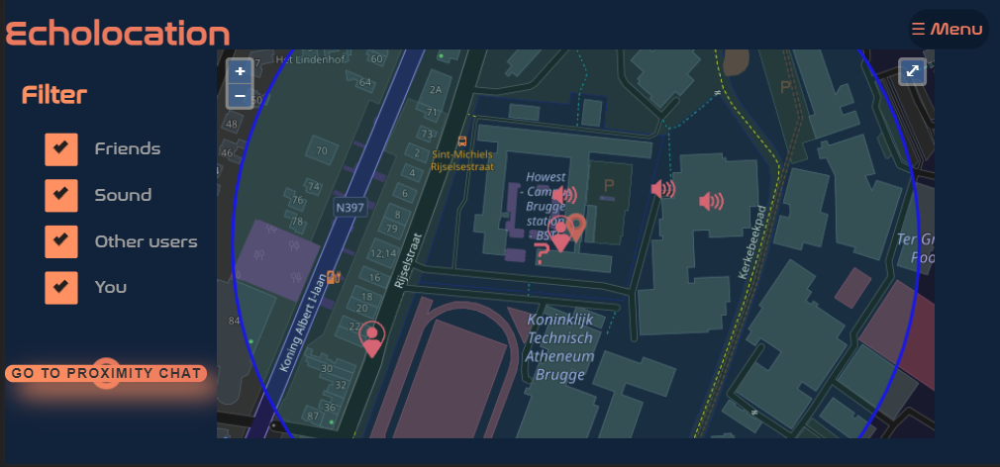

On the home page you can find the map and the filter. On the map you can see different markers, one for your friend, surrounding sounds, the other users and yourself of course. You can filter the marker by unchecking the desired marker.

You can click on the markers and then a popup will appear. Here you have different options for example, with a friend you can find the fastest way to get to him to of start a private chat with him. This can also be done with the other users. 

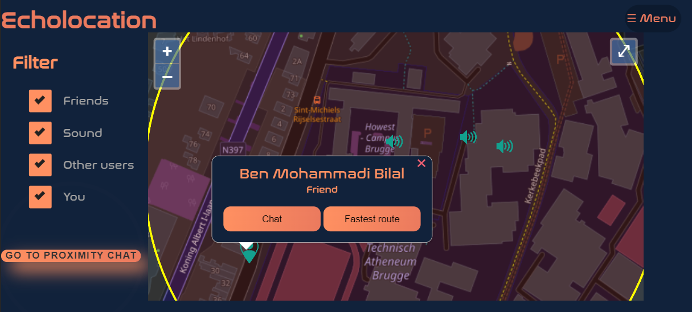


Example of finding the fastest route to your friend.

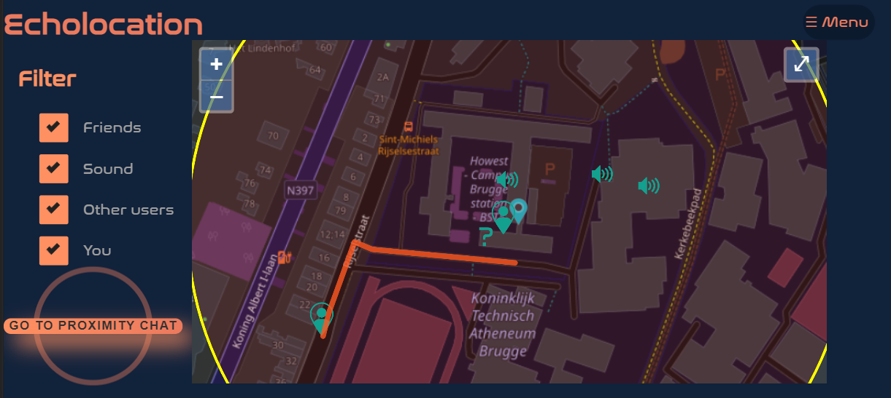

The sound has other options like muting and an overview of all the surrounding sounds.

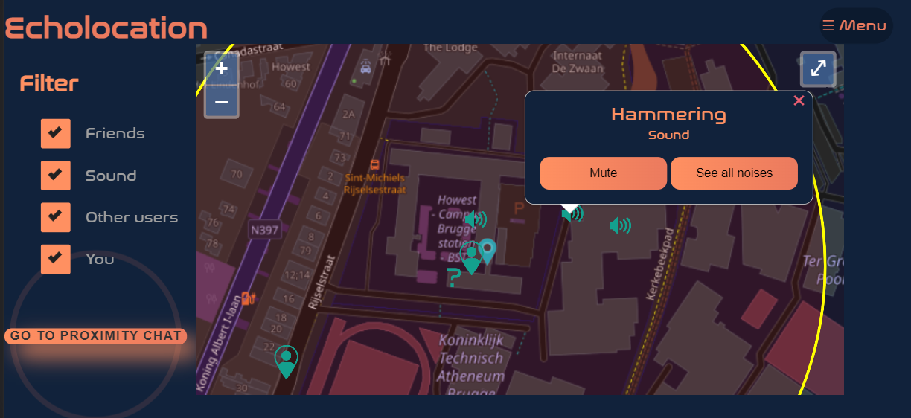

If you want to view all the current sounds select "See all noises" and an Overlay will appear.
Here you can mute all sounds or adjust the volume of the different sounds.

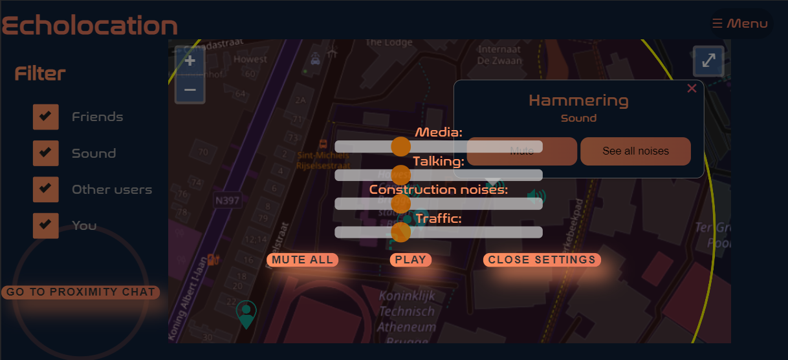

On the home page you can also find the button "Go to proximity chat" this will open the chat where you can chat will all the people in your closes proximity.

## Menu

At the top right corner you'll find the menu option.
This allows you to navigate to the different pages.

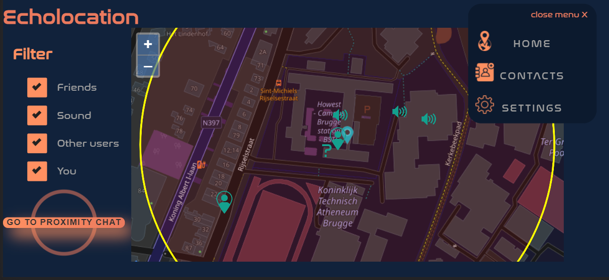


## Contacts page

Severity of the contacts page.

On the contacts page, is it possible to add a contact as a friend. 


You will need the contact ID of the person you want to add.

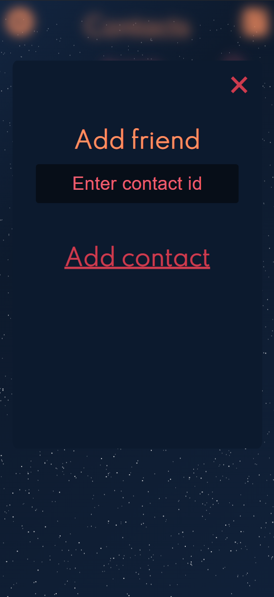

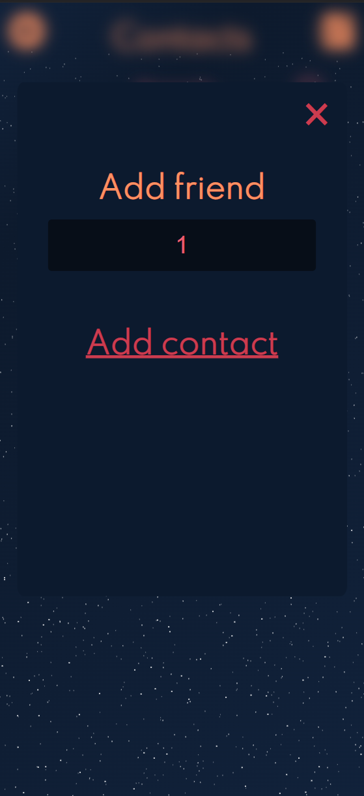

After you added the person you can go back and you'll see that a contact has been added.

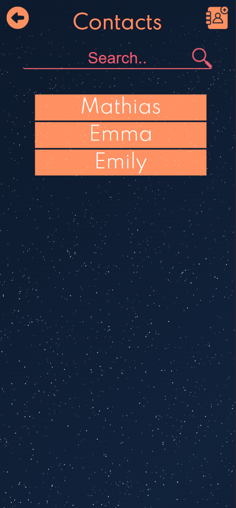

Once you select one of the contacts you can get different options:

- send chat request
- chat with your contact
- remove your contact

Underneath the different options you can receive.


If its a new friend you'll have to send a chat request. This person will receive a notification.

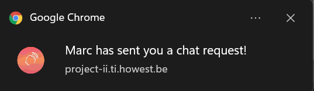

Once your friend accepts your request you will automatically join a chat and you can start chatting!


## Settings page

Finally, there is still the settings page.

On the settings page you can find allot of information, but the two most important things you will find are your own contact Id.And the option to update your version of the software "If possible".

When you click on update an animation will start. 

At the end of the animation it will say that the update was successful.

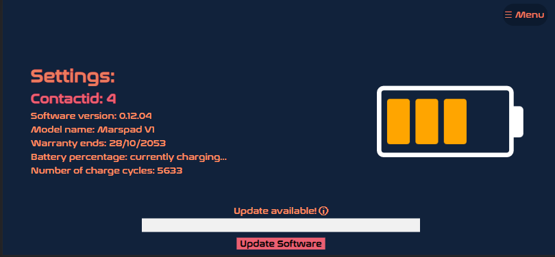

# Resolution of the poc
We choose to use the resolution of the iPhone X. 

If your resolution on your computer is not right a notification will appear. 

There you can see in what resolution you need to place it and in what orientation (landscape or portrait).

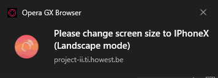

# Run Locally

- Open a terminal in the location you want.
- Type in the terminal 
```bash
git clone git@git.ti.howest.be:TI/2021-2022/s3/analysis-and-development-project/projects/group-17/client.git
```
- This will create a a folder with all the files
- Now you can open the folder with the desired edit program.

# Known bugs

Sometimes when visiting the site online on https://project-ii.ti.howest.be/mars-17/ you might have to reload the site using ctrl + F5, otherwise certain features might not work.

If the server was rebooted, you will have to clear your localstorage and refresh the index page, this is so that you create a new user locally, this only needs to be done if the server has rebooted.

# Video demonstration 

[Click here to download the video](imagesReadme/poc_demo.mp4)

Note: The video is quite large, it takes a while to download and there was something wrong with the sound so there isn't any sound
It may appear that there are a lot of notifications popping up all the time but this is because both browsers are sending their notifications. As for the notification saying change the screen size, this is purely because we had both browsers next to each other. 

As for the first chat request that was sent in this demo, the recipient accidentally clicked on the notification when I was clicking on remove user. It looks like our remove user doesn't work but we can assure you that it does.
