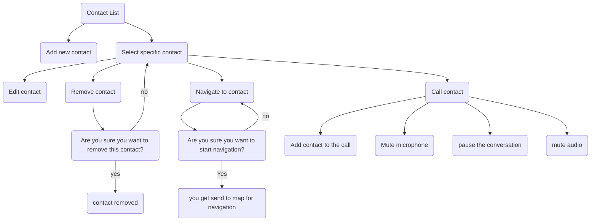

```mermaid
flowchart TD
    CL --> PLUS("Add new contact");
    CL("Contact List") --> PK("Select specific contact");
    
    PK --> ED("Edit contact");
    
    PK --> del("Remove contact");
    del --> SURE("Are you sure you want to remove this contact?");
    SURE --yes --> REM("contact removed");
    SURE --no --> PK;

    PK --> NV("Navigate to contact");
    NV --> SUR("Are you sure you want to start navigation?");
    SUR --Yes --> MAP("you get send to map for navigation");
    SUR --no --> NV;

    PK --> cl("Call contact");
    cl --> ADD("Add contact to the call");
    cl --> MT("Mute microphone");
    cl --> PS("pause the conversation");
    cl --> NA("mute audio");
    

```
