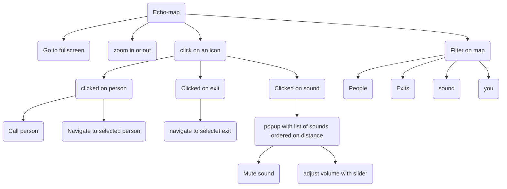

```mermaid
flowchart TD
    Map("Echo-map") --> FS("Go to fullscreen");

    Map("Echo-map") --> Zm("zoom in or out");

    Map("Echo-map") --> ICN("click on an icon");
    ICN --> PERS("clicked on person");
    PERS --> CL("Call person");
    PERS --> NV("Navigate to selected person");

    ICN --> X("Clicked on exit");
    X --> NAV("navigate to selectet exit");

    ICN --> SOUND("Clicked on sound");
    SOUND --> POP("popup with list of sounds ordered on distance");
    POP --> MT("Mute sound");
    POP --> SL("adjust volume with slider");

    Map("Echo-map") --> FLTR("Filter on map");
    FLTR --> PPL("People");
    FLTR --> EX("Exits");
    FLTR --> SND("sound");
    FLTR --> YOU("you");
    

```
