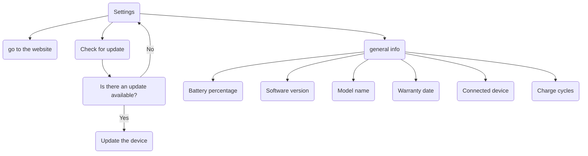

```mermaid
flowchart TD
    Set("Settings") --> SITE("go to the website");
    Set("Settings") --> CU("Check for update");
    Set("Settings") --> REST("general info");
    CU --> AV("Is there an update available?");
    AV --Yes --> UP("Update the device");
    AV --No --> Set("Settings");
    REST --> BT("Battery percentage");
    REST --> VRSN("Software version");
    REST --> MN("Model name");
    REST --> WD("Warranty date");
    REST --> CD("Connected device");
    REST --> CC("Charge cycles");

```
