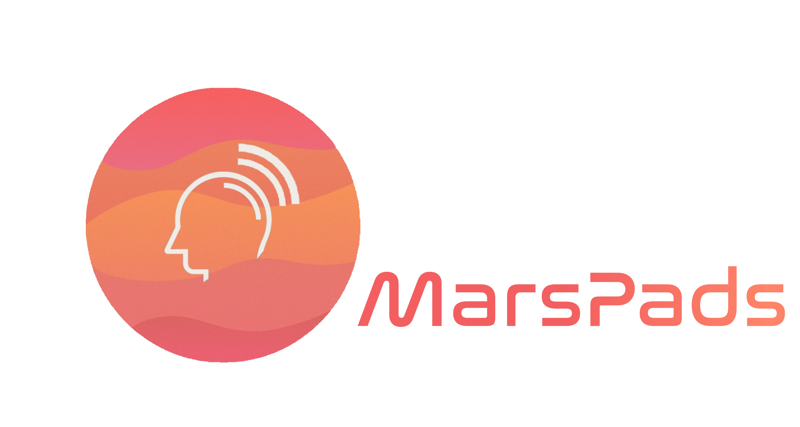
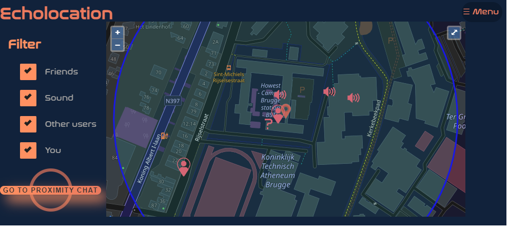
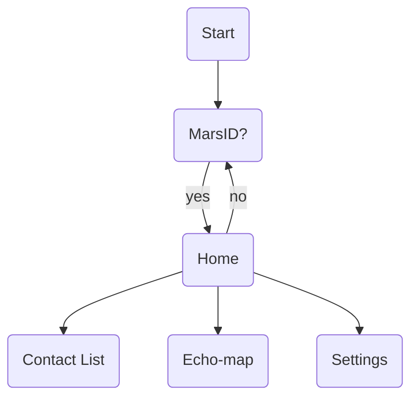
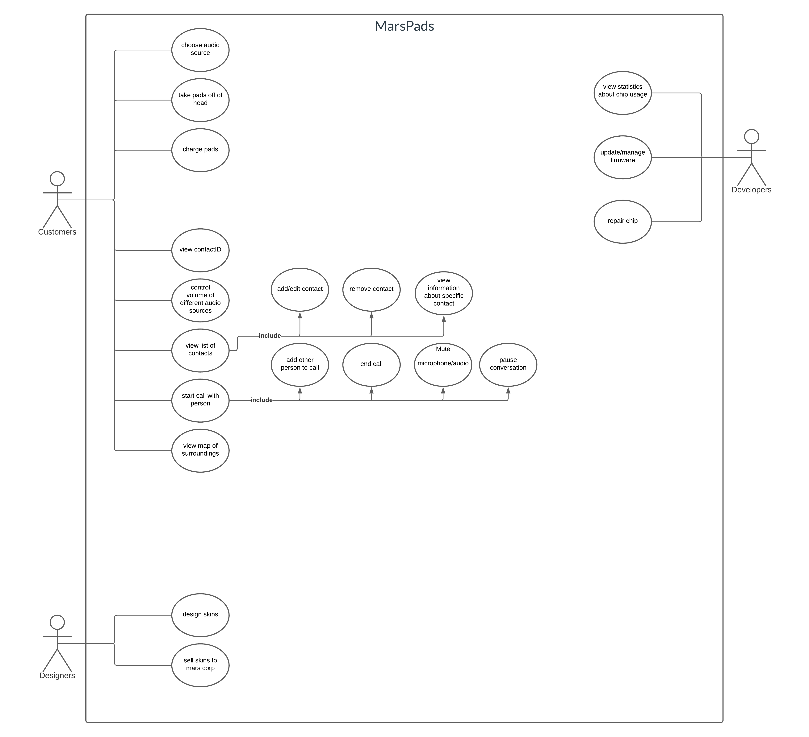
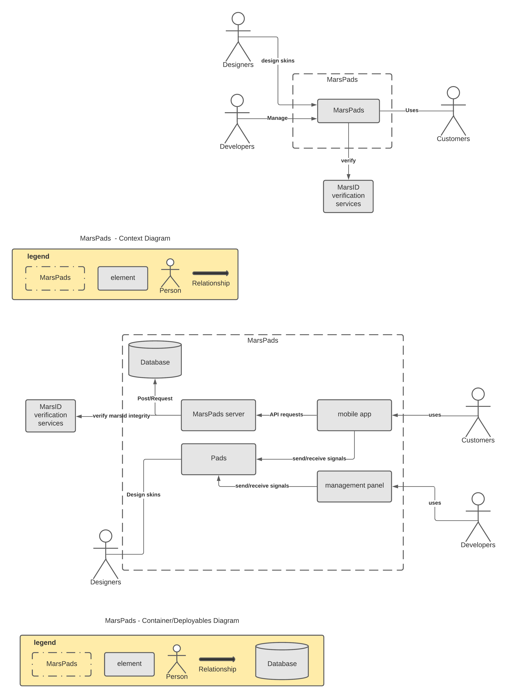
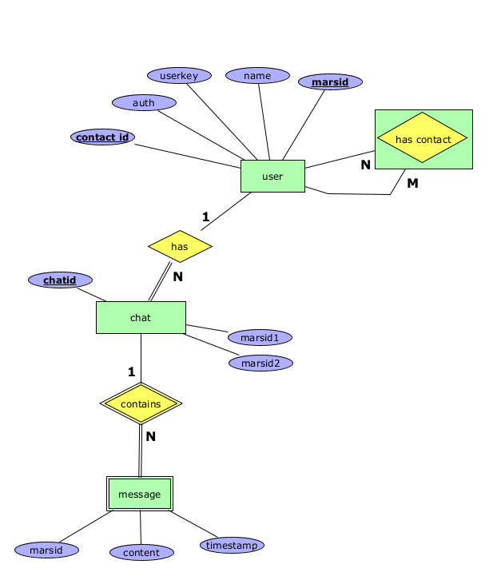

# Sonarlint
<table>
<tr>
<th>Client</th>
<th>Server</th>
</tr>
<tr>
<td>

</td>
<td>

</td>
</tr>
</table>

[[_TOC_]]

# About us
Marspad is a part of our company MarsCorp. We are a tech company that is heavily invested in creating chips. Marspads is our newest product. It's a wearable device witch handles sound, echolocation and way more. Throughout this document, we will give you all the info you need to be 100% along with the ride of our newest success story.

[For more info about our future, security and more, click here](Info/info.md)

# Business case
## Info

Just like every startup, we have to build a good business case to convince people to invest in our project. Hence we produce on a big scale, we calculate with big numbers. We do believe that we succeeded in making a decent business case and providing a real improvement to life. If you want to read more, you can look at the links below to read more about it. 

## Links

[Click here to go to the Business case](https://docs.google.com/document/d/1TtKBMOJmwTC1NPHTKqSwWCAczQxvq2uNkCpxUKfcVlE/edit?usp=sharing)

[Click here to find the different calculations](https://docs.google.com/spreadsheets/d/1EdO3PMgdRSCwCdMW4I5cEPsvochk0H9DS2WsAJCHfSI/edit?usp=sharing)

# Schematics

## OpenAPI-spec

Our OpenAPI spec can be found [here](https://git.ti.howest.be/TI/2021-2022/s3/analysis-and-development-project/projects/group-17/documentation/-/blob/main/api-spec/openapi-mars.yaml)

The API consists of 8 endpoints:

1. Create a user by posting your marsID
2. Get user information like contactid and name by sending marsID
3. Get the contactlist from a specific user by sending their marsID
4. Add a different user to your contactslist by sending their contactid
5. Remove a user from your contactlist by sending their contactid
6. Get all your chats with different users by sending your marsid
7. Get all messages from a specific chat by sending your marsid and the chatid you want to get the messages from
8. Get general information like how many friends you have in total, how many friends are near you and what is the distance to your closest friend by sending your marsid

## Flowcharts

The flowchart gives you an insight of the steps within the app. It illustrates how the application works and how everything is handled. In the example underneath you see the general idea with the main pages. If you want a more detailed view of these pages you can check the links below.

### For a more in depth view of every page, see the folowing links.
<ul>
<li>[Contactlist](Flowcharts/contactlist.md)</li>
<li>[Echo-map](Flowcharts/echo-map.md)</li>
<li>[Settings](Flowcharts/settings.md)</li>
</ul>

## UCD

## C4-diagram

## EERD

# Wireframes

## Content
The following image is a wide overview of the wireframes. If you follow the link below, you will be able to download the wireframes for yourself or open them trough the cloud.

<ul>
<li>Download: [MarsPads.xd](Wireframe/MarsPads.xd)</li>
<li>Cloud link: [Wireframe MarsPads](https://xd.adobe.com/view/9aa77adf-4f80-4c62-b291-03e4296e6013-cff4/?fullscreen) </li>

## User tests

To see if the wireframes were up to the standard we performed a couple of user tests. These made us realise we had to adapt a couple of things, but also assured us that we were in fact on the right track.

[Click here to go to the user tests.](Wireframe/user-test.md)

## Recording
[To download the recording, press this link](Wireframe/2021-12-23_14-39-29.mkv)

# Features 
## Real-time communication 
This is used when you are chatting in the proximity chat or in a private chat.

## Maps
You can see the map on the home screen. We used this to display all the diffrent people and sounds.

## Fullscreen API
You can use the fullscreen option on the map

## CSS animations
We have diffrent animation in our project. Like the button "Go to proximity chat" in the home screen for example.

## Push notifications
You will get a notification when someone sends you a message request, and when your resolution is higher or lower than the prefered resolution. For more information about the resolution [click here](https://git.ti.howest.be/TI/2021-2022/s3/analysis-and-development-project/projects/group-17/client#resolution-of-the-poc).

# Installation
## Application
We have built a Proof of concept to provide you an image of how the app would look in the future. This POC has a close connection with how it would like in real life, but there are always a couple of improvements.

Do keep in mind that it is an application for a handheld device.

If you would like to use it on your desktop or laptop you will have to scale the window down to the specifications of an iPhone X to enjoy the best possible experience.

For someone that wants to test our application on their mobile phone, you don't need to change anything. Just remember that it might not be a perfect fit if it isn't on an iPhone X.

## Links

[Click here to go to the app!](https://project-ii.ti.howest.be/mars-17/)

[Click here to find the client README](https://git.ti.howest.be/TI/2021-2022/s3/analysis-and-development-project/projects/group-17/client/-/blob/main/README.md)

[Click here to find the server README](https://git.ti.howest.be/TI/2021-2022/s3/analysis-and-development-project/projects/group-17/server/-/blob/main/readme.md)

## Locally

<ol>
<li>Install both apps on your pc</li>
<li>go to the [CLIENT repo](https://git.ti.howest.be/TI/2021-2022/s3/analysis-and-development-project/projects/group-17/client) and clone with SSH</li>
<li>Open your webstorm or PHP and click get from VCS</li>
<li>paste the cloned link in the URL and click next.</li>
<li>next goto the [SERVER repo](https://git.ti.howest.be/TI/2021-2022/s3/analysis-and-development-project/projects/group-17/server) and clone with SSH</li>
<li>Open your intellij and also click get from VCS</li>
<li>Now paste the SSH and continue</li>
</ol>

